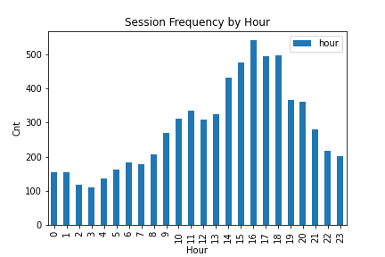
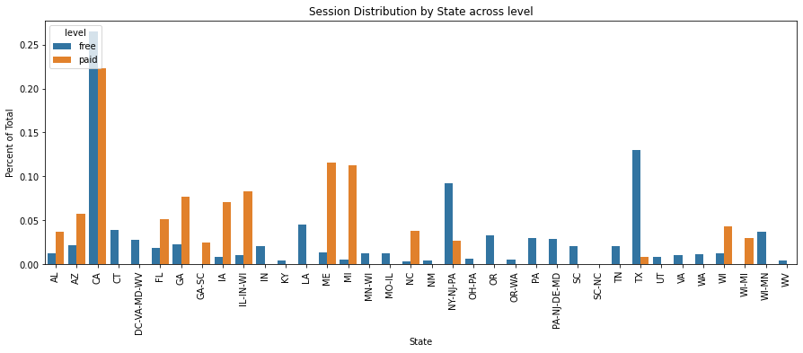

# Udacity Project: Data Modeling with Postgres
In this project, we'll use the Python3 to create an end-to-end data pipeline, to 
1. parse JSON logs from files 
2. create a Postgres database (using the psycopg2 library) 
3. create a schema to store tables
3. build an ETL pipeline to create fact and dimension tables

## Overview
The goal of this project is to build an ETL for songs and user activity on a fictional music streaming app, for analytics purposes.  

## Available Files
The project contains several files and folders, listed bellow

├── README.md  
├── create_tables.py  
├── data  
│ ├── log_data  
│ └── song_data  
├── etl.ipynb  
├── etl.py  
├── sql_queries.py  
└── test.ipynb  

Folder details,
- `log_data` folder that holds simulation based user event logs in JSON format.
- `song_data` folder that holds a subset of the [Million Song Dataset](http://millionsongdataset.com/) in JSON format.

Document details can be found bellow,
- `create_tables.py` first step of the ETL, drop and create the tables. Run this file to reset the tables before each time the ETL scripts are run.
- `etl.py` file to read and process files from `song_data` and `log_data` and load them into the tables. 
- `sql_queries.py` contains all the sql queries, and is imported into both the files above.

Testing scripts (no need to run), 
- `etl.ipynb` jupyter notebook that reads and processes a single file from `song_data` and `log_data` and loads the data into the tables. This notebook contains detailed instructions on the ETL process for each of the tables.
- `test.ipynb` jupyter notebook that displays the first few rows of each table to let one check the database (sanity check).
- `analytics.ipynb` jupyter notebook with dashboards for analytics

## Set-up
### 1. Virtual Environment
Set up a virtual environment
```
$ python3 -m venv .venv
$ source .venv/bin/activate
```
Install dependencies available in this repo
```
$ pip install -r requirements.txt
```
### 2. Install postgresql with brew
Additionally, the project uses postgresql, use the following commands to set it up
1. Update brew ```brew update```
2. Install postgresql ```brew install postgresql```
3. Upgrade database```brew postgresql-upgrade-database```

### 3. Set up database
Finally, create the appropriate roles in postgresql
1. Connect to postgres  
```bash
$ psql postgres
```
2. Create appropriate roles in postgres 
```buildoutcfg
postgres=# CREATE ROLE student WITH LOGIN PASSWORD 'student';
postgres=# CREATE DATABASE studentdb;
postgres=# GRANT ALL PRIVILEGES ON DATABASE studentdb TO student;
postgres=# ALTER USER student CREATEDB;
```

## Execution
One can use the command line to first create the schema and tables, by executing
```bash
$ python3 create_tables.py 
```
then run the following, to add data in the existing tables
```bash
$ python3 etl.py 
```

## Database Overview
### Fact Table(s)
```
sparkifydb.songplays
- description: records in log data associated with song plays (page:NextSong)
- columns:
    - songplay_id: SERIAL PRIMARY KEY
    - start_time: TIMESTAMP
    - user_id: INT
    - level: VARCHAR
    - song_id: VARCHAR
    - artist_id: VARCHAR
    - session_id: INT
    - location: VARCHAR
    - user_agent: VARCHAR
```

### Dimension Table(s)
```
sparkifydb.users 
- description: users in the app
- columns:
    - user_id: INT PRIMARY KEY
    - first_name: VARCHAR
    - last_name: VARCHAR
    - gender: VARCHAR
    - level: VARCHAR
```
```
sparkifydb.songs 
- description: songs in music database
- columns:
    - song_id: VARCHAR PRIMARY KEY
    - title: VARCHAR
    - artist_id: VARCHAR
    - year: INT
    - duration: FLOAT
```
```
sparkifydb.artists 
- description: artists in music database
- columns:
    - artist_id: VARCHAR PRIMARY KEY
    - name: VARCHAR
    - location: VARCHAR
    - latitude: FLOAT
    - longitude: FLOAT
```
```
sparkifydb.time 
- description: timestamps of records in songplays broken down into specific units
- columns:
    - start_time: TIMESTAMP PRIMARY KEY
    - hour: INT
    - day: INT
    - week: INT
    - month: INT
    - year: INT
    - weekday: INT
```
## Analytics
Finally, we have data available for analytics. Bellow, we have attached three dashboards to answer important questions about the app usage.

**Which time of the day app usage peaks?**  
For 2pm-6pm the app has the highest usage.



**Which day of the week Users use the app the most?**  
Wedsday and Friday have the peak usage, while usage slows down over the weekend.


**Which state has the largest free vs paid levels?**  
California is the state with most User in both free and paid levels. The market in Texas seems to have a high volume of free Users, which might be a large opportunity for the company. 

